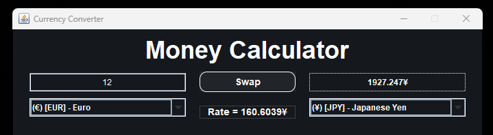

# Money Calculator | IS2

## Overview

Money Calculator is a currency converter application that uses the [FreeCurrency API](https://freecurrencyapi.com) to fetch available currencies and exchange rates. It allows users to convert money from one currency to another.

## Features

- Fetches available currencies from the FreeCurrency API.
- Retrieves the latest exchange rates.
- Converts money between different currencies.
- User-friendly Swing-based graphical interface.

## Installation

1. Clone the repository:
	```sh
	git clone https://github.com/SkinnyDevi/is2-money-calculator.git
	```
2. Navigate to the project directory:
	```sh
	cd is2-money-calculator
	```
3. Launch the project using Java using the Main class in `apps.swing.Main`

## Screenshots



## Dependencies

- [Gson](https://github.com/google/gson) - A Java library to convert JSON to Java objects and vice versa.
- [Jsoup](https://jsoup.org/) - A Java library for working with real-world HTML and making/sending requests.

## Author

- Felix Miguel Velasquez ([@skinnydevi](https://github.com/skinnydevi))